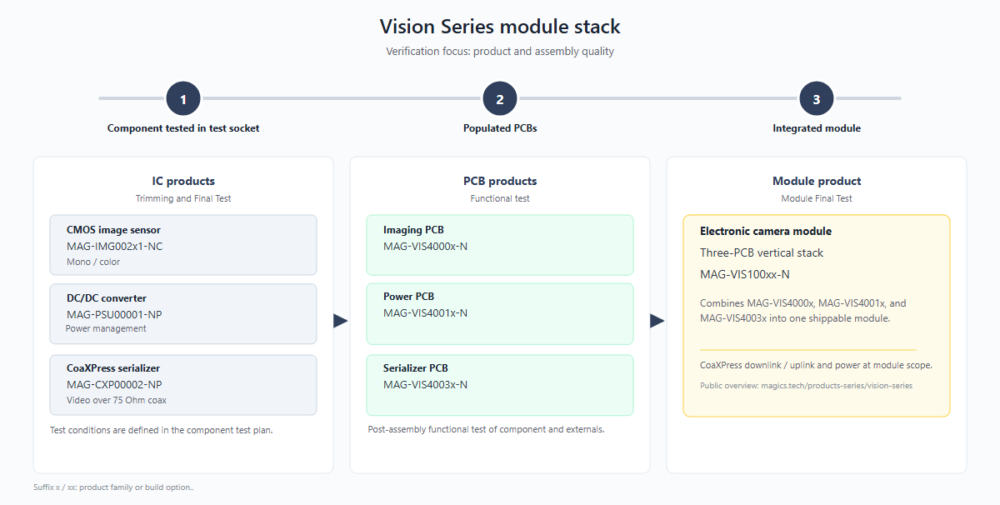
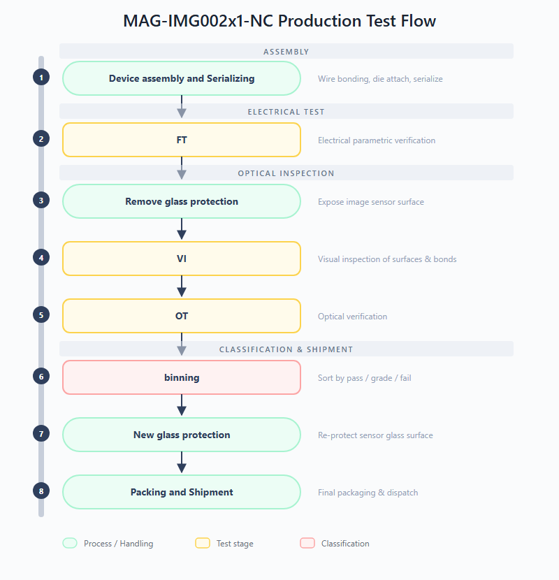
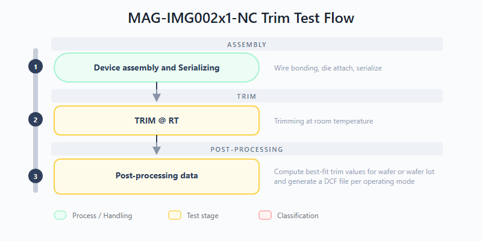
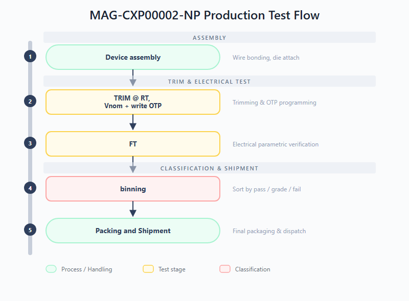
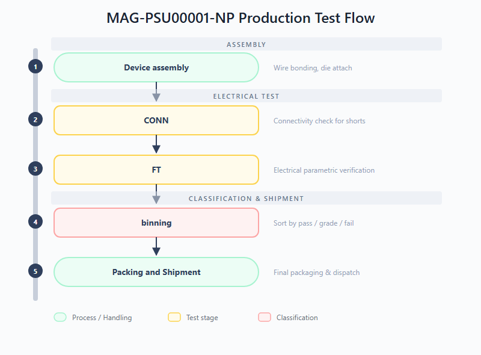
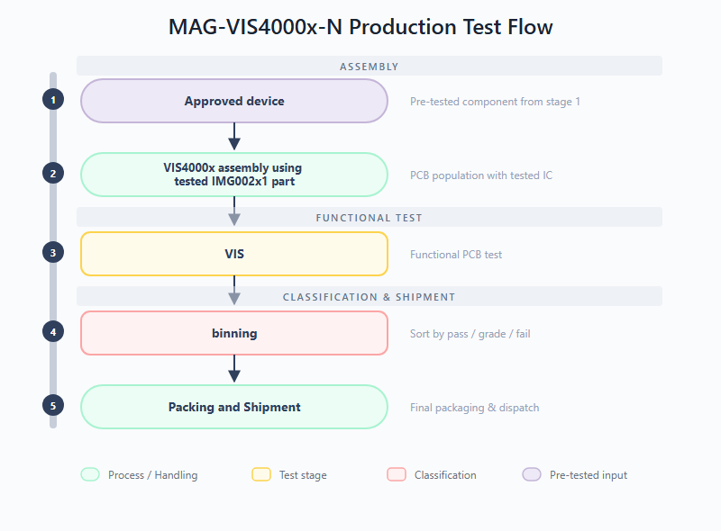
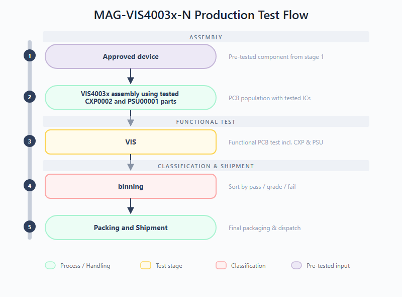
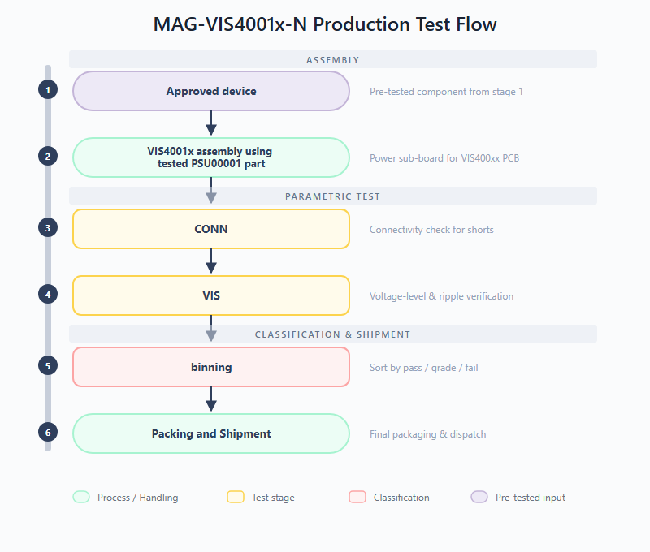
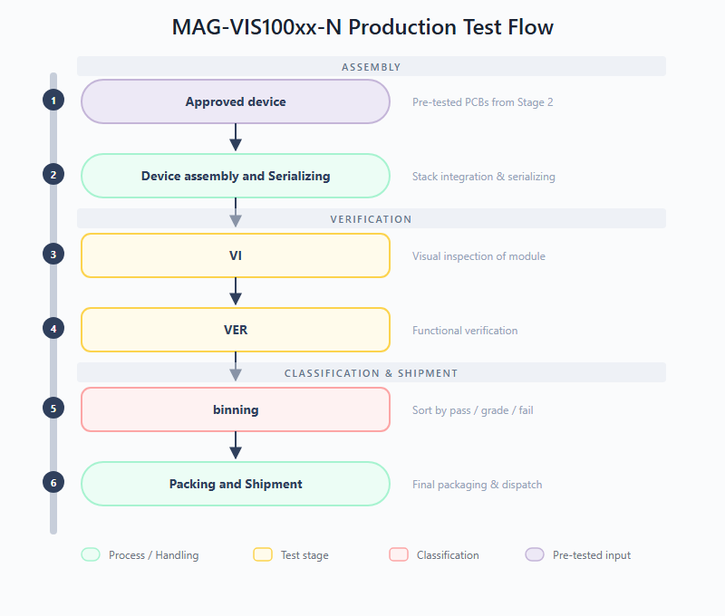

# Vision Series Test Plan Document

## 1. Revision History

| Revision | Date | Description | Author |
| :--- | :--- | :--- | :--- |
| 1.0 | 2026-04-10 | Initial draft of the Vision Series Test Plan | Test Architect |
| 1.1 | 2026-04-13 | Updated diagrams and test stage descriptions | Test Architect |

## 2. List of Figures

- Figure 1: Vision Series: three-step verification rail
- Figure 2: MAG-IMG002x1-NC Production Test Flow
- Figure 3: MAG-IMG002x1-NC Trim Test Flow
- Figure 4: MAG-CXP00002-NP Production Test Flow
- Figure 5: MAG-PSU00001-NP Production Test Flow
- Figure 6: MAG-VIS4000x-N Production Test Flow
- Figure 7: MAG-VIS4003x-N Production Test Flow
- Figure 8: MAG-VIS4001x-N Production Test Flow
- Figure 9: MAG-VIS100xx-N Production Test Flow

## 3. List of Tables

- Table 1: MAG-IMG002X1-NC Key Specifications
- Table 2: MAG-CXP00002-NP Key Specifications
- Table 3: MAG-PSU00001-NP Key Specifications
- Table 4: MAG-VIS100xx-N Key Specifications

---

## 4. Introduction & Scope

This document outlines the verification for the Magics Technologies Vision Series products to ensure suitability for nuclear environments. The Vision Series includes standalone radiation-hardened ICs (Image Sensor, Serializer, DC/DC Converter) and fully integrated electronic Vision Modules.

This test plan details the test conditions, test flows, test stages, and the production and trimming tests required to guarantee the reliability and performance of the products.

---

## 5. Vision products verification process

The verification and testing of the Vision Series products follow a three-step horizontal process rail. This ensures that quality is maintained incrementally from the IC component level up to the fully integrated module. While testing a MAG-VIS100xx product spans from component to module, our verification is gated: customers purchasing IC-only or PCB products receive components that have successfully cleared the specific segments of the rail required for those tiers.

*Figure 1: Vision Series: three-step verification rail*

### 5.1 Level 1: Component verification
- **Focus**: IC products are tested in test sockets across multiple conditions as specified in their individual test plans. These production tests focus on maximizing test coverage to ensure the early detection of any manufacturing defects. 
- **Products**: MAG-IMG002x1-NC, MAG-PSU00001-NP, MAG-CXP00002-NP.
- **Description**: This level covers Trimming and Final Test (FT) of the individual integrated circuits. Testing procedures include continuity checks, I/O pin tests, interface tests, and parametric testing (including optional trimming). Functional verification and application-specific testing are also performed in addition to tests specific for the product family.

### 5.2 Level 2: PCBs verification
- **Focus**: Functional verification of assembled PCB products
- **Products**: MAG-VIS4000x-N (Imager PCB), MAG-VIS4001x-N (Power PCB), MAG-VIS4003x-N (Serializer PCB).
- **Description**: This level covers the functional testing of post-assembly boards prior to stack integration. Verifies that the soldering and board-level interconnects are reliable and that the individual sub-systems function correctly.

### 5.3 Level 3: Module verification
- **Focus**: Verification of the fully integrated module
- **Products**: MAG-VIS100xx-N (Three-PCB vertical stack).
- **Description**: This level covers the Module Final Test (MFT). It verifies the CoaXPress downlink/uplink and power delivery across the entire module scope. This final product level test validates high-speed timing and synchronization between the different components, ensuring any timing errors are caught at full operational speed.

---

## 6. Test specifications

While the previous chapter outlined the high-level verification progression of the Vision Series products along the horizontal process rail, this chapter provides the detailed test specifications for each product, organized by product level test.

Note that the test procedures listed in this chapter measure significantly more parameters than those published in the product datasheets. The additional data collection serves Magics internal process monitoring: it enables detailed analysis of block and function-level performance on each IC, tracking of parametric drift over production lots, and early detection of process shifts. All internal parameters carry defined limits and are actively monitored during production. To keep this report concise, only the parameters that are specified in the product datasheets are discussed in the acceptance criteria of Chapter 7.

### 6.1 Level 1: IC Test Specifications

This section covers the production and trimming tests for the individual integrated circuits. ICs are tested in test sockets across multiple conditions, focusing on maximizing test coverage for early detection of manufacturing defects.

#### 6.1.1 MAG-IMG002x1-NC (Image Sensor IC)

##### Test flow

The production and trimming test flows for the image sensor are depicted below. The production flow covers electrical verification, visual inspection, and optical testing. A separate trim flow is used to calibrate internal references and timing settings.

*Figure 2: MAG-IMG002x1-NC Production Test Flow*

*Figure 3: MAG-IMG002x1-NC Trim Test Flow*

*Production test stages:*
- **FT (Final Test):** Confirms that the product is compliant against test limits. This stage performs full electrical parametric verification of the image sensor, including continuity, power supply integrity, I/O thresholds, output drive strength, and power consumption measurements.
- **VI (Visual Inspection):** Examination of external surfaces, glass lid, and wire bonding. This inspection identifies visible defects such as cracks, delamination, contamination, or bond wire anomalies before the device proceeds to optical testing.
- **OT (Optical Test):** Characterization of the optical performance of the image sensor. This stage validates dynamic range, pixel response uniformity, dark current, and other electro-optical parameters.

*Trim test stages:*
- **TRIM @ RT:** Trimming at room temperature. Internal references are calibrated to their target values by applying and verifying trim codes at room temperature.
- **Compute best-fit trim values:** Post-processing of measured trim data to compute best-fit trim values for wafer or wafer lot and generate DCF file per mode.

##### Test procedures

The table below lists all test procedures applicable to the MAG-IMG002x1-NC and indicates in which test stage each procedure is executed. The FT stage provides full electrical parametric coverage, while TRIM focuses on calibrating internal references. The OT stage validates optical performance under controlled illumination, and the VIS stage re-uses a subset of tests to verify the image sensor after PCB assembly.

| Test procedure | Description | FT | TRIM | OT | VIS |
| :--- | :--- | :---: | :---: | :---: | :---: |
| Continuity | Each pin is connected to an SMU with power supplies off. A small current is forced into the pin, and the resulting voltage drop over the ESD structure is measured to verify proper pin connectivity. | X | X | X | |
| Power Short | Checks for shorts on the power rails by supplying a very low voltage and measuring the resulting current per power domain. | X | X | X | |
| Leakage | Measures the leakage current of each input pin or tristate output pin. | X | X | | |
| VIL/VIH | Checks the input hysteresis of all digital input pins by sweeping the input voltage and observing the digital state transition. | X | | | |
| VOL/VOH | Measures the low and high voltage of digital outputs at 1 mA load. | X | | | |
| IOL/IOH | Measures the low and high level output current of digital outputs. | X | | | |
| IDDD | Measures the current consumption of the DUT in multiple states, video modes, frame rates and test patterns. | X | X | | |
| Test buffer offset | Measures the offset of both test buffers on the test mux. | X | X | | |
| Static signal test | Measures the voltage/current of certain internal signals. | X | | | |
| PLL open-loop | Measures the open-loop frequency of the VCO while forcing the VCO voltage. | X | | | |
| PLL lock | Checks the lock status and measures the PLL-lock frequency. | X | | | |
| Ramp gen test | Measures the delay of the readout circuitry. | X | | | |
| POR | Validates the power-on reset behaviour of the device. | X | | | |
| Trigger mode | Generates an external trigger pulse and validates the DUT responds correctly. | X | | | |
| Testpattern generator | Tests the internal testpattern generator by comparing a captured image with a predefined reference. | X | | | X |
| Serial interface | Validates the SPI serial interface functionality. | X | X | X | X |
| Trim test | Trims each internal block (voltage reference, current reference) by sweeping trim codes and selecting the best-fit value. | | X | | |
| Ramp gen trim | Trims the ramp generator circuitry to target voltage and slope values. | | X | | |
| Frame modes | Validates the different video modes by capturing and verifying images. | | | X | |
| Blackpixel readout | Tests the black reference pixel readout. | | | X | |
| Optical init | Defines the exposure time range required for correct linear fitting in DC and PTC analysis, and measures light nonuniformity. | | | X | |
| Optical defect map | Captures raw images to map bright/dead pixels, rows and columns. | | | X | |
| Optical PTC capture | Captures raw images necessary for Photon Transfer Curve (PTC) and spatial nonuniformity (SN) analysis. | | | X | |
| Optical DC capture | Captures raw images necessary for dark current (DC) per pixel analysis. | | | X | |
| Optical test processing | Reads raw images from previous tests and performs PTC, SN and DC per pixel analysis. Results are combined and reported to the results database. | | | X | |
| IDD VIS | Measures the power supply current consumption on the VIS board, where supplies with the same voltage level are shorted and sourced as a single channel. | | | | X |

#### 6.1.2 MAG-CXP00002-NP (CXP Interface IC)

##### Test flow

The production test flow for the serializer IC is depicted below. After device assembly, the chip undergoes trimming and OTP programming, followed by a comprehensive final test.

*Figure 4: MAG-CXP00002-NP Production Test Flow*

*Production test stages:*
- **TRIM @ RT, Vnom + write OTP:** Trimming at room temperature and nominal voltage. Internal references and biasing are calibrated, and one-time programmable memory is written with the final trim configuration.
- **FT (Final Test):** Confirms functional and parametric compliance of the serializer. Verifies electrical parameters against specification limits after trimming to ensure the device operates within its intended performance envelope.

##### Test procedures

The table below lists all test procedures applicable to the MAG-CXP00002-NP and indicates in which test stage each procedure is executed. The TRIM stage calibrates internal LDOs and references and programs the OTP memory, after which the FT stage verifies the full parametric and functional performance of the serializer, including its high-speed CXP interface and SPI communication channels.

| Test procedure | Description | FT | TRIM |
| :--- | :--- | :---: | :---: |
| Continuity | Each pin is connected to an SMU with power supplies off. A small current is pushed into the pin to verify proper pin connectivity via the ESD diode voltage drop. | X | X |
| Power Short | Checks for shorts on the power rails by supplying a very low voltage and measuring the resulting current per power domain. | X | X |
| Pin leakage | Measures the leakage current of each input pin or tristate output pin by applying low and high voltage and measuring the current. | X | X |
| VIL/VIH | Checks the input hysteresis of all digital input pins by performing high-to-low and low-to-high voltage sweeps. | X | |
| VOH/VOL | Measures the low and high voltage of digital outputs under a load current of 1 mA. | X | |
| IOL/IOH | Measures the low and high level output current of digital outputs. | X | |
| IDDD | Measures the current consumption of the DUT in multiple states, video modes, frame rates and test patterns. | X | X |
| Test Buffer Offset | Measures the offset of both test buffers on the test mux by creating a loop through GPIO pins and sweeping the input voltage. | X | X |
| Static Signal Test | Measures all static signals available on the test mux and stores results in the database. | X | |
| Regulators | Performs a load test on the LDOs with external decoupling by sweeping load currents and measuring the internal output voltage through the test mux. | X | |
| Oscillator | Checks the reference clock circuits of the DUT. | X | |
| PLL Open Loop | Checks the PLL open loop behaviour by opening the loop and measuring the v_tune voltage range. | X | |
| PLL Lock | Checks the PLL closed loop behaviour by observing key parameters of the locked PLL. | X | |
| IO SPI Slave | Validates the debug SPI slave interface by reading and writing registers. | X | X |
| IO SPI Master CAM | Validates the camera SPI master interface by reading and writing a register in the FPGA acting as SPI slave. | X | |
| IO SPI Master GPIO | Validates the GPIO SPI master interface by reading and writing a register in the FPGA acting as generic SPI slave. | X | |
| CXP Uplink Receiver Sensitivity | Checks receiver sensitivity using a function generator to send CXP sequences at varying amplitudes, performing a binary search for the sensitivity threshold. | X | |
| Internal Test Patterns | Validates the internal test pattern generator by looping over test patterns and capturing them with the frame grabber. | X | |
| Camera Test | Sends and captures test patterns from an external camera (FPGA pattern generator) and compares raw pixel values with a reference. | X | |
| OTP Data Retention | Reads data from OTP and verifies that no bits are flipped. | X | X |
| Block Trimming | Trims each block (LDO, voltage reference, current reference) by performing a sweep and selecting the trim setting closest to the target value. | | X |
| OTP Write | Writes the final trim configuration data into the OTP cells and verifies successful programming. | | X |

#### 6.1.3 MAG-PSU00001-NP (Power Management IC)

##### Test flow

The production test flow for the DC/DC converter IC is depicted below. The IC undergoes connectivity and parametric testing after assembly.

*Figure 5: MAG-PSU00001-NP Production Test Flow*

*Production test stages:*
- **CONN (Connectivity Test):** Checks for shorts on the DUT interface. DUTs must pass this stage before proceeding to ensure the test socket contact is reliable and no assembly defects are present.
- **FT (Final Test):** Verifies the chip is within specifications. Checks all electrical parameters (voltage levels, thresholds, regulation, efficiency) against defined minimum and maximum spec limits.

##### Test procedures

The table below lists all test procedures applicable to the MAG-PSU00001-NP. All procedures are executed during the FT stage. The PSU00001 does not include trimming or NVM programming; the CONN connectivity check is performed as a gate before the FT procedures listed here.

| Test procedure | Description | FT |
| :--- | :--- | :---: |
| Power Short | Verifies that there is no short to ground on the power terminals of the chip. | X |
| Load Short | Verifies that there is no short to ground or power on the load terminals of the chip. | X |
| Leakage | Measures the input leakage current of all accessible input pins. | X |
| Input threshold | Finds both the high and low threshold voltages (VIL/VIH) for the Enable pin. | X |
| Output drive-strength | Measures the current that can be sunk by the power-good output. | X |
| On-chip regulator | Measures the regulator voltage and performs a load regulation test on the internal regulator. | X |
| Under Voltage Lock Out | Finds the threshold voltages where the chip enters and exits UVLO. | X |
| Output voltage monitor | Checks the +/-6.5% output voltage limits of the control loop by forcing the internal sense voltage. | X |
| Over Temperature Protection | Checks the over-temperature protection via the power-good flag and PTAT voltage. | X |
| Startup behaviour | Measures the start-up behaviour of the output voltage and checks the level/time where the power-good flag goes high. | X |
| Inv_Enable functionality | Checks that the functionality of the Enable pin can be inverted using the Inv_Enable configuration. | X |
| Line regulation | Measures the input voltage dependency of the output voltage. | X |
| Load regulation | Measures the load current dependency of the output voltage. | X |
| Efficiency | Measures efficiency over different loads and input/output voltage conditions. | X |

### 6.2 Level 2: PCB Test Specifications

This section covers the functional testing of the three post-assembly sub-boards (Imager, Serializer, and Power PCBs) prior to stack integration. Each PCB is assembled with 1 or more pre-tested IC components from level 1. 
All three boards share a common test philosophy: an initial "Approved device" input gate verifies that only pre-tested level 1 components are used, followed by board-level assembly and a Vision (VIS) functional test stage that validates the sub-system operates correctly at the PCB level. The VIS test stage consists of a collection of test procedures from the component level with optional deticated tests to increase test coverge.  

#### 6.2.1 Test flows

The production test flows for the three assembled PCBs are depicted below. While the overall structure is similar across all boards, the specific test content differs to match each sub-system's functionality.

**MAG-VIS4000x-N (Imager PCB)** -- Pre-tested image sensor components from level 1 are assembled onto the PCB, followed by a functional test of the board.

*Figure 6: MAG-VIS4000x-N Production Test Flow*

**MAG-VIS4003x-N (Serializer PCB)** -- Pre-tested serializer and DC/DC converter components from level 1 are assembled onto the PCB, followed by a functional test of the CXP link and power delivery sub-system.

*Figure 7: MAG-VIS4003x-N Production Test Flow*

**MAG-VIS4001x-N (Power PCB)** -- Pre-tested DC/DC converter components from level 1 are assembled onto the board, followed by parametrical test to check voltage load/line regulation behaviour and ripple performance. This board additionally includes a CONN (Connectivity Test) test stage before the VIS test stage.

*Figure 8: MAG-VIS4001x-N Production Test Flow*

#### 6.2.2 Test stages

All three PCBs share the **VIS (Vision Test)** test stage as their primary functional verification. The Power PCB additionally includes a **CONN** test stage. The specific scope of each VIS test is:

- **VIS4000x -- VIS (Vision Sub-board Test):** Functional test of the assembled imager PCB. Validates that the board-level interconnects and the image sensor readout chain operate correctly after PCB population. The most important verification test in this VIS test stage is the read out of a set of test patterns that are hard coded in the image sensor IC.
- **VIS4003x -- VIS (Vision Sub-board Test):** Functional test of the assembled serializer PCB. Validates the CXP link functionality and power delivery sub-system at the board level. The most important verification test in this VIS test stage is the read-out (via CXP interface) of a set of external test patterns that are applied to the video pins.
- **VIS4001x -- CONN (Connectivity Test):** Checks for shorts and opens at the board level, verifying that PCB assembly and soldering have not introduced connection faults.
- **VIS4001x -- VIS (Vision Sub-board Test):** Verifies functionality of the DCDC sub-board on the MAG-VIS400xx PCBs, including voltage-level accuracy and ripple under worst case DC conditions.

#### 6.2.3 Test procedures

The tables below list the test procedures for each PCB during its VIS test stage. These procedures are a subset of the component-level tests, re-used at the board level to verify correct assembly and interconnect integrity. The Power PCB additionally includes a CONN stage for connectivity verification before the VIS tests.

**MAG-VIS4000x-N (Imager PCB) -- VIS test stage:**

| Test procedure | Description |
| :--- | :--- |
| Testpattern generator | Tests the internal testpattern generator of the image sensor IC via the PCB-level readout chain, comparing the captured image with a predefined reference. |
| Serial interface | Validates SPI communication with the image sensor at the board level. |
| IDD VIS | Measures the power supply current consumption on the VIS board, where supplies with the same voltage level are shorted and sourced as a single channel. |

**MAG-VIS4003x-N (Serializer PCB) -- VIS test stage:**

| Test procedure | Description |
| :--- | :--- |
| IO SPI Master CAM | Validates the camera SPI master interface by reading and writing a register in the FPGA acting as SPI slave. |
| IO SPI Master GPIO | Validates the GPIO SPI master interface by reading and writing a register in the FPGA acting as generic SPI slave. |
| Internal Test Patterns | Validates the internal test pattern generator by looping over test patterns and capturing them with the frame grabber. |
| Camera Test | Sends external test patterns (from FPGA pattern generator) to the video input pins and captures the CXP output to verify pixel-accurate data integrity. |
| OTP Data Retention | Reads data from OTP and verifies that no bits are flipped. |
| VDD3V3 DCDC | Checks the output voltage of the on-board DCDC converter. |

**MAG-VIS4001x-N (Power PCB) -- CONN + VIS test stages:**

| Test procedure | Description |
| :--- | :--- |
| Power Short | Verifies that there is no short to ground on the power terminals at the board level. |
| Load Short | Verifies that there is no short to ground or power on the load terminals at the board level. |
| Line regulation | Measures the input voltage dependency of the output voltage at the board level. |
| Load regulation | Measures the load current dependency of the output voltage at the board level. |
| Efficiency | Measures efficiency over different loads and input/output voltage conditions at the board level. |
| Output voltage ripple | Measures ripple amplitude and frequency on the board output. |

### 6.3 Level 3: Module Test Specifications

This section covers the Module Final Test (MFT) for the fully integrated vision module (MAG-VIS100xx-N, three-PCB vertical stack). It verifies the CoaXPress downlink/uplink and power delivery across the entire module scope, validating high-speed timing and synchronization between the different components.

#### 6.3.1 Test flow

The production test flow for the fully integrated vision module is depicted below. Pre-tested and approved PCBs from level 2 (Imager, Power, and Serializer boards) are assembled into the final three-PCB vertical stack, followed by visual inspection and comprehensive functional verification.

*Figure 9: MAG-VIS100xx-N Production Test Flow*

*Production test stages:*
- **VI (Visual Inspection):** Assessment of the physical condition of the assembled module to identify visible defects before electrical testing. Checks for cracks, pin issues, delamination, solder anomalies, or mechanical damage on the integrated stack.
- **VER (Functional Verification):** Confirms that the integrated module is compliant (functional and parametric) against its specifications for normal use-cases. This stage validates CXP downlink/uplink communication, power delivery across the module, image data integrity, and trigger functionality at full operational speed.

#### 6.3.2 Test procedures

The table below lists all test procedures for the integrated module. The VI stage is a manual inspection performed before any electrical test. The VER stage validates the complete signal chain -- from power delivery through image capture to CXP serialization -- at full operational speed. Module variants that include the MAG-DRV IC have additional driver-specific tests.

| Test procedure | Description | VI | VER |
| :--- | :--- | :---: | :---: |
| Visual inspection | Verifies the physical integrity of the assembled module prior to electrical testing, ensuring no mechanical damage, solder defects or contamination is present that could affect performance or safety. | X | |
| Power consumption | Measures the current consumption of the fully integrated module. | | X |
| CXP Core functionality and video data check | Verifies basic functionality of the MAG-CXP00002-NP IC and CoaXPress video data -- checks lock bits, writes and reads a known register via CoaXPress to confirm communication, enables internal test pattern mode and verifies the correct pattern is received by the frame grabber. | | X |
| IMG Core functionality and video data check | Verifies basic functionality of the MAG-IMG002x1 IC -- checks PLL status bits, tests image manipulation logic (y-axis flip), enables the internal Test Pattern Generator (TPG) and verifies the received image pattern via CoaXPress under various video modes and frame rates. | | X |
| IMG Trigger mode | Provides full functional verification of all imager trigger modes: CXP hardware trigger flow, imager free-run burst mode (30-frame burst) and imager software trigger burst mode. | | X |
| MAG-DRV Capabilities (MAG-VIS1000x only) | Verifies functional operation of the MAG-DRV IC outputs in both steady-state (ON/OFF) and dynamic (PWM) modes, using oscilloscope and MUX card to check all channels. | | X |
| MAG-DRV Motor drive capabilities (MAG-VIS1002x only) | Verifies the MAG-DRV IC ability to drive external loads for directional movement of Iris, Zoom and Focus motors, verifying correct drv_enable register values for both directions and safe disable (OFF state). | | X |

---

## 7. Product Specifications & Acceptance Criteria

The key specifications for the Vision Series products are extracted from their respective datasheets. The acceptance criteria and test limits are defined in the production test plans.

### 7.1 MAG-IMG002X1-NC (Full HD CMOS Image Sensor)

**Table 1: MAG-IMG002X1-NC Key Specifications**

| Parameter | Specification | Test Condition / Acceptance Criteria |
| :--- | :--- | :--- |
| **Resolution** | 1920 x 1080 (Full HD) | Validated via image capture test |
| **Frame Rate** | Up to 30 FPS | Validated via continuous mode test |
| **Dynamic Range** | > 60 dB | Characterized during optical test |
| **Supply Voltage** | 1.8V (Digital), 3.3V (Analog) | VDD pin voltage test |
| **Power Consumption** | < 1W (typical) | IDD current measurement |
| **Radiation Hardness (TID)** | > 1 MGy | Guaranteed by design and lot acceptance |
| **Radiation Hardness (SEE)** | > 62.5 MeV.cm²/mg | Guaranteed by design |

### 7.2 MAG-CXP00002-NP (CoaXPress Serializer ASIC)

**Table 2: MAG-CXP00002-NP Key Specifications**

| Parameter | Specification | Test Condition / Acceptance Criteria |
| :--- | :--- | :--- |
| **Downlink Speed** | 1.25 Gbps | Tested via functional interface test |
| **Uplink Speed** | 20 Mbps | Tested via functional interface test |
| **Supply Voltage** | 3.3V | VDD pin voltage test (LSL: 3.0V, USL: 3.6V) |
| **Power Consumption** | 272 mW (typical) | IDD current measurement |
| **Clock Input** | 10 - 40 MHz | Tested via PLL lock verification |
| **Radiation Hardness (TID)** | > 1 MGy (100 Mrad) | Guaranteed by design and lot acceptance |
| **Radiation Hardness (SEE)** | > 60 MeV.cm²/mg | Guaranteed by design |

### 7.3 MAG-PSU00001-NP (10W Synchronous Step-Down DC/DC Converter)

**Table 3: MAG-PSU00001-NP Key Specifications**

| Parameter | Specification | Test Condition / Acceptance Criteria |
| :--- | :--- | :--- |
| **Input Voltage Range** | 5V to 11V | UVLO High (LSL: 4.4V, USL: 4.8V) |
| **Load Capability** | 4A (active cooling) | IOL/IOH current tests |
| **Switching Frequency** | 1 - 3 MHz | Functional switching test |
| **Input Leakage Current** | - | LSL: -10mA, USL: 10mA |
| **VIL (Input Low Voltage)** | 0.73V (typical) | LSL: 0.67V, USL: 0.78V |
| **VIH (Input High Voltage)** | 0.815V (typical) | LSL: 0.77V, USL: 0.90V |
| **Radiation Hardness (TID)** | > 1 MGy | Guaranteed by design and lot acceptance |
| **Radiation Hardness (SEE)** | 64 MeV.cm²/mg | Tested free of destructive SEEs |

### 7.4 MAG-VIS100xx-N (Electronic Vision Module)

**Table 4: MAG-VIS100xx-N Key Specifications**

| Parameter | Specification |
| :--- | :--- |
| **Components** | MAG-IMG002X1, MAG-CXP0002, 2x MAG-PSU00001 |
| **Input Voltage** | 9V (generates 3.3V and 1.8V internally) |
| **Video Interface** | CoaXPress 1.25 Gbps (75-Ohm coax) |
| **Radiation Hardness** | > 1 MGy TID (Si) |
| **Operating Temp** | 0 to 50 °C ambient |
